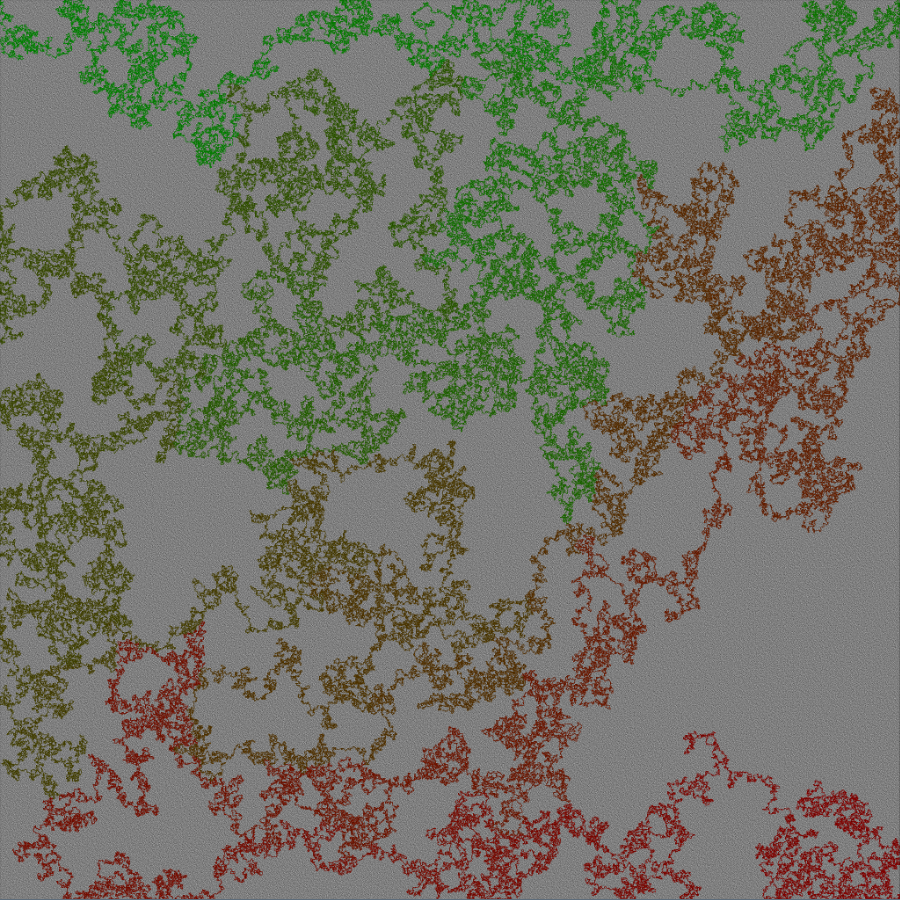

# DeveMazeGenerator, C#, Huge Mazes, 3D, Pathfinding & More

My maze generator written in C#, highly optimized to generate huge mazes (128.000x128.000 for example), find the shortest path and then save it all to an image. In the latest version I've also added a MonoGame project to render the mazes in 3D (also works on android)

Currently the fastest algorithm is "AlgorithmBacktrack" with "BitArreintjeFast". If you want a fast maze, use that ;).

If you want to create a MASSIVE maze take "AlgorithmBacktrackSmartMemory" as algorithm and "Hybrid" as InnerMap (I'm talking about MASSIVE 512.000x512.000 and bigger) (It's about 40% of the speed of the AlgorithmBacktrack with the BitArreintjeFast innermap but uses almost no memory).



Above, a 4096*4096 maze (Generated in 0,5 seconds)

The largest maze I generated and saved was 524.288*524.288. It can be found on the following website:
http://www.gigapan.com/gigapans/171239

### Current functionality:
* Generate mazes
* See them being generated live
* See pathfinding live
* Save them with or without path (to png, bmp, jpeg, etc)
* Calculate walls (can be used to draw maze in 3d, I also have a sample of this if anyone is interested)
* A GUI application with all kinds of buttons that do things
* Different inner storage formats (Highly optimized BitArray, the normal .net BitArray, a Boolean array, a directly mapped on the hard drive and a Hybrid storage format (see below))
* On a hard drive with 2TB you could theoretically generate a maze of the following size (This will take weeks / months to complete though):
```
SQRT(2000000000000*8)=4000000, so a maze of about 4 million * 4 million
```
* See the % of a maze being generated by using the callback (See the GUI application for an example, The HUUUGE maze button)
* Added button to get the walls from a maze and draw them, I sort this list in very unique ways for cool effects :P
* Added a new project for 3D mazes

### Todo: (If you want me to work on any of these just throw me an email)
* Add like 8 other maze generation algorithms (Kruskal, prim, eller, division, etc)

### Things this project tought me:
* Enums are default ints, this means they take up 32-bit (or 4 bytes) in memory when placed in an array.
* 64-bit projects can use way more memory.
* You can use the option "AllowVeryLargeObject" to allow bigger objects.
* Booleans are 1 byte in memory size.
* A BitArray can be used to store 8 booleans in 1 byte.
* How to implement different maze generation algorithms.
* How to profile code in Visual Studio.
* How to create images without wasting memory when creating them.
* Writing callbacks with Actions.
* That the Random class is not Thread safe :/.
* How to write my own pathfinder that's faster then A* (It finds "a path" which is always the shortest since the mazes have only 1 path)
* How the garbage collector won't collect all garbage sometimes (when generating loads of mazes multithreaded for a long time)
* How you can use 2 bits to store a direction where you came from with BitShifting
* Lot's more

### Me
My nickname is Devedse, I did this project for fun and to learn more about C#. If anyone is interested or has any questions you can send me a message :).

## Information about the project itself

### Algorithms
* AlgorithmBacktrack (100%) (Fast, cool mazes, very low memory usage)
* AlgorithmBacktrackSmartMemory (100%) (About 70% of the speed of AlgorithmBacktrack but uses about 0,1% of the memory for storing the path while generating internally)
* AlgorithmKruskal (90%) (Average speed, cool mazes, high memory usage)
* AlgorithmDivisionBreadthFirst (30%) (Not done)
* AlgorithmDivisionDepthFirst (30%) (Not done)
* AlgorithmEller (30%) (Not done)
* AlgorithmPrim (30%) (Not done)
* AlgorithmPrimCenter (30%) (Not done)
* AlgorithmHuntKill (30%) (Not done)

The AlgorithmBacktrackSmartMemory only saves every junction in a maze when generating, at these junctions only the previous direction is saved, so only 2 bits are needed per junction. Junctions occur only every 50 steps, this reduces memory by about 50 times. Also this algorithm saves these with bitshifting, this reduces the memory usage even further to about 0.1%.

### InnerMaps (The way the maze is stored while generating)
* BooleanInnerMap (Memory usage = n, Speed = 100%)
* BitArreintjeFastInnerMap (Memory usage = n/8, Speed = ~90%)
* DotNetBitArrayInnerMap (Memory usage = n/8, Speed = ~80%)
* BitArrayMappedOnHardDiskInnerMap (Memory usage = 0, Speed = ~0,2%)
* Hybrid (Memory usage = like 20 mb max with default settings, Speed = ~50%)
This hybrid map divides the maze in a number of parts (a grid). Each part will be loaded into the memory when needed and written to the disk if possible too. This really is the best way to generate REALLLYYY REAALLLLYYYYY big mazes pretty fast. (This only works well with AlgorithmBacktrackSmartMemory though because the other algorithms have more overhead)

### The steps I took for minimal memory usage (Focussing mainly on AlgorithmBacktrack and eventually AlgorithmBacktrackSmartMemory):
* I first created this maze generator where it used an enum for every point in the maze, solid or not solid. (32 bits per point)
* The first issue I ran against was that the memory was overflowing when generating big mazes, I changed the execution from 32bit to 64bit and in the App.config I allowed VeryLargeObjects.
* I changed this enum to a boolean (8 bits per point)
* I started to use BitArray's (1 bit per point)
* I created my own implementation of the BitArray that's faster then the one from C# and used "MethodImpl(MethodImplOptions.AggressiveInlining)" (20% speed increase)
* I optimized out some code in the AlgorithmBacktrack class and started using an Array which gets reused for finding the next destination (10% speed increase)
* I then chose to create a new implementation of the InnerMap that stored the maze completely on the hard disk sacrificing speed for 0 memory usage.
* This resulted in a very slow solution. That's why I then chose to create the Hybrid map, it loads only 10 parts of the maze it's currently working on in memory, so the memory usage stays really low while still maintaining about 50% of the original speed.
* The issue I ran into after this solution was that the stack used by the AlgorithmBacktrack (The path from beginning to the current point) was actually using the most memory. That's why I rethought the solution and created a stack which only stores junctions instead of every point while generating a maze. These junctions are stored as a direction to the previous point we came from (for example top if we came from the top). Since we only have 4 values here we only need 2 bits to store these values. That's why I created the "QuatroList" and "QuatroStack" which stores an int between 0 - 3 in only 2 bits.
* After all these optimizations the Hybrid map only uses 20mb memory max and AlgorithmBacktrackSmartMemory uses about 0.1% of the memory the stack used previously while still being quite fast.

And then came, saving the maze to an image:

* I first used the basic Bitmap class in the .NET framework. This class could however only handle images to around 4.000x4.000. (I also included the path that was Green at the start and slowly moved to Red the further it came to the end)
* I then found a way to manually bitshift the pixels into this class. This combined with using 4 bits per pixel resulted in a possible image size of around 16.000 x 16.000. The backside of this was that I could only use ~16 colors so the beautiful path was a bit ruined.
* To go bigger and to be able to use the better path I started using the Hjg.Pngcs which is able to write row by row. By doing this I quickly went to be able to write images of around 128.000 x 128.000.
* At this stage I ran into the same problem I had previously when creating a maze, the Path was actually longer then what a list would allow (~int.MaxValue) and therefore also touching the limits of my memory once again. To resolve this I only generate the junctions beforehand and provide this list to the Image Saving Class. Then this Image Saving class can run through these junctions to determine a subsection of the path that can be saved in the maze (e.g. row 0 to row 2048).
* Using this approach I was able to generate my biggest maze to date: http://www.gigapan.com/gigapans/171239 . However the problem I ran into now was that saving this maze took around 5 days. The algorithm I used to save PNG's read the maze row by row. Doing this meant that the Hybrid map had to reload every section for every row which results in a lot of overhead. The solution for this was using another image writing framework which suports Tiles: TIF. Using TIF I was able to reduce the save time again significantly because it would generate a complete chunk instead of a row and then save that to disk. 
* Using all these approaches I now ran into some occasional memory issues creating the 1.000.000 maze. (Mostly after around 4 days of saving which made the debugging process a horror). This is why I implemented some pre-path-analysis functions. This will analyse the path beforehand and determine how much PathPoints exist for each row. Based on this and available memory it will choose the best TileSize to use. When it starts a row it will also determine for how much rows it can load the path in memory. Using this it will sometimes write more chunks and when there's a lot of path to write it will write less.
* Going through the code I then saw that every time I iterated over the dynamic path I would have to redetermine the length of the path (effectively iterating the complete path twice every time). Thinking about this a bit gave me the idea to first determine the length of the path and then creating a new IEnumerable based on this already determined length. (Mixing yield returns and normal returns). Now it only has to execute the path count once and will increase the performance of saving a maze by a factor of around 2 again.

## Contact
If you have any issues, questions or just want to talk to me, throw me a message and get in contact with me :).
